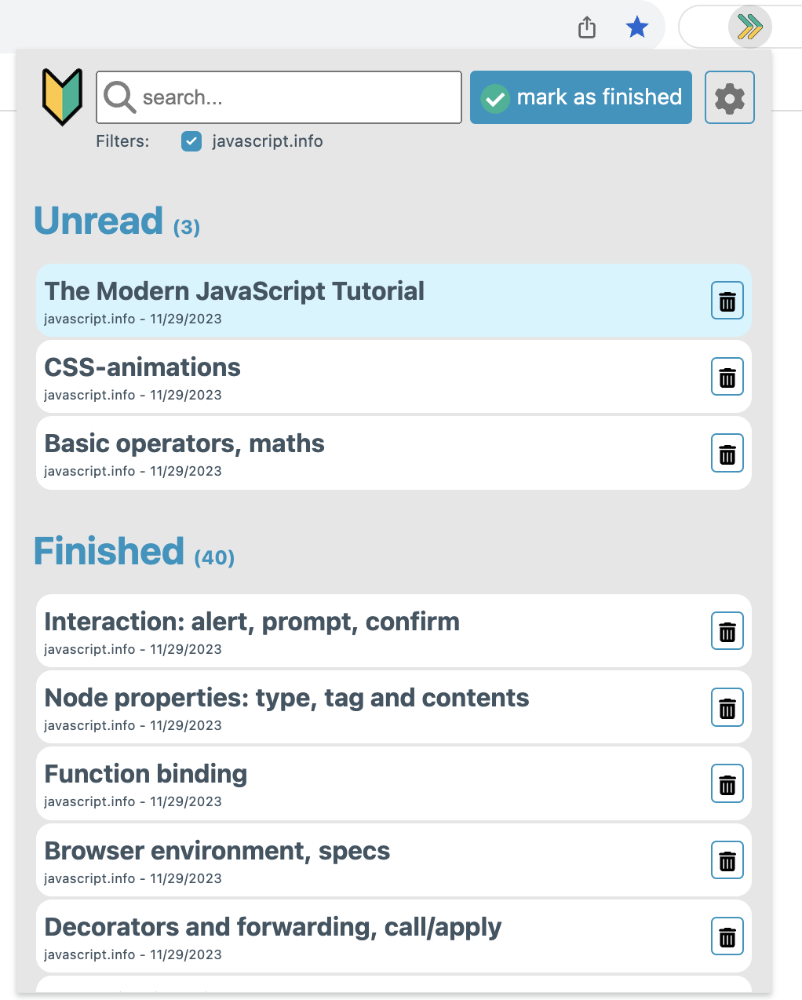

# Mark as Done (Chrome & Firefox Extension)

> Easily track the reading status of any page. 
> All the links to these pages are automatically highlighted on the original website, 
> helping you keep track of your reading progress of large documentations or books.


For example, the following shows a partially read website, with some links marked as done. 

  

And below is the extension popup, showing the status of pages and where you can update the status.



## Features

  -  Visual indicators for marked pages, the original website
  -  Export and import your marked pages list

# Icons
| Icon | Meaning                     |
| --- |-----------------------------|
|  | Current page is not marked. |
|  | Page is unread              |
|  | Page is marked as finished  |


# How to Install

Chrome: [Mark as Done on Chrome Web Store](https://chrome.google.com/webstore/detail/mark-as-done/eamfmbodggklinbmhfgeogcpebhfoojb?hl=de)  
Firefox: [Mark as Done on Firefox Add-ons](https://addons.mozilla.org/en-US/firefox/addon/mark-as-done/)

Or: Clone the repository and "load unpacked" as described in [Chrome Developer Guide](https://developer.chrome.com/docs/extensions/mv3/getstarted/#manifest)

# Notes

* Only sites that have any marked pages are processed, ensuring no slowdown for sites not used with this extension.
* The permission is requested individually for each website, so that only the sites you use with this extension are affected.
* The logo 🔰 means: We are constantly learning. See [Source](https://emojipedia.org/japanese-symbol-for-beginner/)

# Reviews
If you find our extension useful, please consider leaving a review on the 
[Chrome Web Store](https://chrome.google.com/webstore/detail/mark-as-done/eamfmbodggklinbmhfgeogcpebhfoojb?hl=de) or 
[Firefox Add-ons](https://addons.mozilla.org/en-US/firefox/addon/mark-as-done/). Your feedback is greatly appreciated!


# Development

Please use  Commit Message Format: 
- https://semantic-release.gitbook.io/semantic-release/#commit-message-format  
- https://github.com/angular/angular/blob/main/CONTRIBUTING.md#-commit-message-format  

## Build

```bash
npm run build
```

## Run / Debug

```bash
npm run start:firefox
```

or 

```bash
npm run start:chrome
```

## Lint

```bash
npm run lint
```

## Release

Releases are triggered automatically when merging pull requests. This also updates the extension in the chrome and firefox store. 

