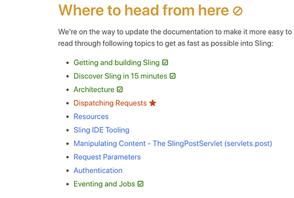
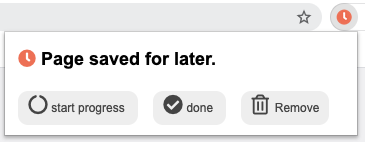

# Mark as Done (Chrome & Firefox Extension)

> Mark any page as Done, Todo, or Started. All the links to that page will be automatically marked with an icon and colored, helping you keep track of your reading progress of large documentations or books.


For example, the following shows a partially read website, with some links marked as done. 

  

With one click, the page is marked as Todo, Started, or Done.




## Features

  -  Mark pages as Todo, Started, or Done with one click
  -  Visual indicators for marked pages
  -  Export and import your marked pages list
  -  Works on Chrome and Firefox


# Icons
 **Inactive**: Extension is not yet active on this site.  
 **Ready**: Extension is active, current page is not marked.   
 **Todo**: Page is marked as Todo  
 **Started**: Page is marked as Started or partially completed  
 **Done**: Page is marked as Done  

# How to Install

Chrome: [Mark as Done on Chrome Web Store](https://chrome.google.com/webstore/detail/mark-as-done/eamfmbodggklinbmhfgeogcpebhfoojb?hl=de)
Firefox: [Mark as Done on Firefox Add-ons](https://addons.mozilla.org/en-US/firefox/addon/mark-as-done/)

Or: Clone the repository and "load unpacked" as described in [Chrome Developer Guide](https://developer.chrome.com/docs/extensions/mv3/getstarted/#manifest)

# How to Use

**Activate on site:** 
Click the icon  to activate highlighting links for this site.

**Mark a page:** Click the icon , then mark the current page as Todo, Started, Done, or unmarked. 


**List all pages / Export**: Right-click on the Icon, then Click "Options" (Chrome) or "Manage Extension" (Firefox).

# Notes

* Only sites that have any marked pages are processed, ensuring no slowdown for sites not used with this extension.
* Logo meaning 🔰: We are constantly learning. See [Source](https://emojipedia.org/japanese-symbol-for-beginner/)

# Reviews
If you find our extension useful, please consider leaving a review on the 
[Chrome Web Store](https://chrome.google.com/webstore/detail/mark-as-done/eamfmbodggklinbmhfgeogcpebhfoojb?hl=de) or 
[Firefox Add-ons](https://addons.mozilla.org/en-US/firefox/addon/mark-as-done/). Your feedback is greatly appreciated!


# Development

## Build

```bash
npm run build
```

## Run / Debug

```bash
npm run start:firefox
```

## Lint

```bash
npm run lint
```

## Deploy

Sign for Firefox: 
```bash
web-ext sign --api-key "user:xxx" --api-secret "xxxx"
```
