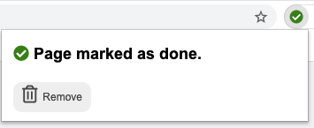

# Mark as Done (Chrome Extension)

> Mark any page as Done. All the links to that page will be automatically marked with an icon and colored.
> This helps you keep track of your reading progress of large documentations or books.

For example, the following shows a partially read website, with some links marked as done. 

  

With one click the page is marked as TODO: 


And then it's easy to mark it as done: 




# Symbols

 *  Page is marked as **Todo** 
 *  Page is marked as **Started**, or **partially completed**
 *  Page is marked as **Done** 


# How to Install

Chrome: https://chrome.google.com/webstore/detail/mark-as-done/eamfmbodggklinbmhfgeogcpebhfoojb?hl=de
Firefox: https://addons.mozilla.org/en-US/firefox/addon/mark-as-done/

Or: Clone repo and "load unpackaed" as described in https://developer.chrome.com/docs/extensions/mv3/getstarted/#manifest

# How to Use

**Activate on site:** Click the icon , then follow the wizard to add permissions for a site.

**Mark a page:** Click the icon , then mark the current page as Todo, Started, Done, or unmarked. 


**List all pages / Export**: Right-click on the Icon, then Click Options 

# Notes

* Only sites that have any marked pages are processed. This makes sure to not slow down the browser for sites that are 
  not used with this extension.
* What does the Logo 🔰 mean? : We are constantly learning. See [Source](https://emojipedia.org/japanese-symbol-for-beginner/)

# Development

## Build

```bash
npm run build
```

## Run / Debug

```bash
npm run start:firefox
```

## Lint

```bash
npm run lint
```
