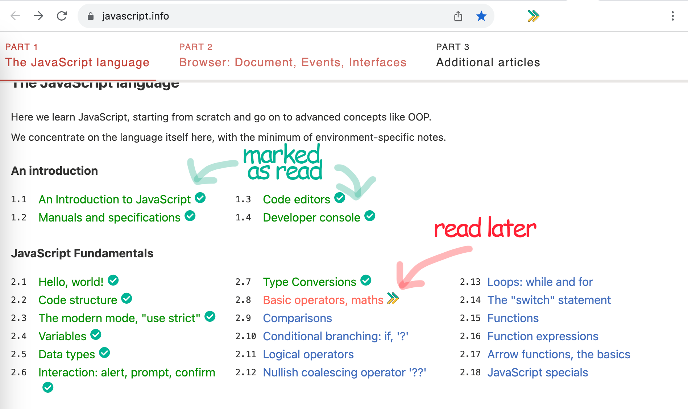

# Mark as Done (Chrome Extension)

> Mark any page as Done. Then all links to that page are marked with a colorful icon.
> This allows you to read through big documentations, while keeping track of the completed pages.

The following shows a partially read website, with some links marked as done. 

  

# Symbols

 *  Page is marked as **Done** 
 *  Page is marked as **Todo** 
 *  Page is marked as **Started**, or **partially completed**

# How to Install

Clone repo and "load unpackaed" as descibed in https://developer.chrome.com/docs/extensions/mv3/getstarted/#manifest

# How to Use

**Activate on site:** Click the icon , then follow the wizard to add permissions for a site.

**Mark a page:** Click the icon , then mark the current page as Todo, Started, Done, or unmarked. 

**List all pages / Export**: Right-click on the Icon, then Click Options 

# Notes

* Initially, the extension has no permissions. It will only update links on pages that were added by the user.
* What does the Logo 🔰 mean? : We are constantly learning. See [Source](https://emojipedia.org/japanese-symbol-for-beginner/)